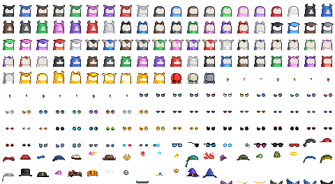
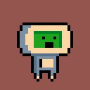

**What's News? Updates**

We are live!  The world's first ORC-721 collections (on bitcoin) include:

- 721 D.I.Y. Punks 
- 721 D.I.Y. Punks V2
- 1000 D.I.Y. Ordibots
- 1000 D.I.Y. Ordibots V2
- 721 D.I.Y. Cool Cats
- ....

Wen [next] deploy?   You are welcome to announce your ORC-721 collections
in the ordinal punks discord (in the #generative-orc-721 channel).
For an invite
see <https://twitter.com/OrdinalPunks/status/1620230583711576068>.

I NEED YOUR HELP ...

... let's prepare the Week 02 - D.I.Y. Birdies (max. 721) deploy today (Sun Jun 4th) if possible ... <br>
... the spritesheet.png is ready to inscribe and has 200+ tiles (20 columns x 11 rows = 220 tiles / sprites)  ... it's about 35kb  ... <br>
... see



... your comments more than welcome on the new Week 02 - D.I.Y. Birdies collection - the structure is - bodies first incl. golden and skeleton (bone/red) and robot - the beak ("nose") -  eyes - and optional eyewear, headwear, and clothing - that's it.<br>
... and again the call for help ...... if anyone wants to sponsor / lead the inscribe (spritesheet today (Sun Jun 4th) and deploy tomorrow (Mon Jun5th), please tell in the ordinal punks discord (in the #generative-orc-721 channel) - you make it all happen ...


NEW!  For up-to-date ORC-721 analytics / statistics see the [Generative-ORC-721 Dune dashboard](https://dune.com/jokie/orc-721-dashboard)  - thanks to Jokie.


---


# Generative Art ORC-721 Protocol / Standard for Bitcoin & Co.

Author:  [Gerald Bauer](https://github.com/geraldb) ([Punk's Not Dead](https://github.com/cryptopunksnotdead), [Learn Pixel Art](https://github.com/learnpixelart), etc)


Let's deploy a new 721 d.i.y. punk (pixel head) collection
in 8 seconds ;-) - yes, you can. Example - [Inscription No. 9947030](https://ordinals.com/inscription/753f663770d816f61acd35da8dd04e122eec8582e93ca36b2122f2d4ac206089i0):


``` json
{
    "p": "orc-721",
    "op": "deploy",
    "slug": "diypunks",
    "name": "D.I.Y. Punks",
    "max": 721,
    "dim": "24x24",
    "generative": "cf5df319bbe23fa3d012e5ee0810700c8e82aebff41164246f0d87d7b60a9903i0"
}
```


That's it. Ready to mint the first d.i.y. punk with the (generative) specs - `[0]`:

- 0 -  punk (human) base


``` json
{
   "p":"orc-721",
   "op":"mint",
   "s":"diypunks",
   "g":[0]
}
```

  4x


and the second with the (generative) specs - `[0,38]`:

- 0 -   punk (human) base
- 38 -  laser eyes

``` json
{
   "p":"orc-721",
   "op":"mint",
   "s":"diypunks",
   "g":[0,38]
}
```

  4x


and the third with the (generative specs) - `[59,0,38]`:

- 59 -   background - bitcoin pattern
- 0 -   punk (human) base
- 38 -  laser eyes

``` json
{
   "p":"orc-721",
   "op":"mint",
   "s":"diypunks",
   "g":[59,0,38]
}
```

  4x


and so on.


NEW!  Try the [D.I.Y. Punks Previewer »](https://ordbase.github.io/generative-orc-721/diypunks)


Where's the catch?   Step 0: To make  it work you can (re)use
existing inscribed spritesheets / art layers or inscribe your very own.
Read on.


## Spritesheet / Artwork Layers Inscriptions

To inscribe your spritesheet(s) / art layers you have
three format options:

1) binary image - ultra-compact (less bytes, saving sats!)
2) tabular text / dataset (.csv) - compact (less bytes, saving sats!)
3) structured text / dataset (.json)  - classic


Let's use the d.i.y (ordinal) punks as an example.


### Format Option 1) Binary Image - Ultra-Compact

Inscribe the spritesheet / art layers as a single binary image file (image/png).

Example - [spritesheet.png (~4kb) @ Inscription No. 9917010](https://ordinals.com/inscription/cf5df319bbe23fa3d012e5ee0810700c8e82aebff41164246f0d87d7b60a9903i0):


<details>
<summary markdown="1">4x</summary>


</details>


Note:  To make it work all sprites or attributes MUST be of the same image dimension (e.g. 24x24) and get referenced by number (starting with 0)
counting left-to-right and top-to-bottom.


Thus, for example `[59,0,38]` from the mint starter examples:

``` json
{
   "p":"orc-721",
   "op":"mint",
   "s":"diypunks",
   "g":[59,0,38]
}
```

references the sprites / attributes no. 59 - ,
no. 0 - ,
no. 38- 
and the sprites / attributes
get merged / stacked / pasted-on-top-of-each-other in the order listed resulting in .


Aside - Pasted On Top Of Each Other?!

Yes, the (generative) magic is the transparent background / color!
If you merge a solid / fully opaque image (let's say all black)
on-top-of another image, than it gets completly overwritten -
to make the (generative) magic work - use the transparent color
in your sprite / art layers.


### Format Option 2) Tabular (.csv) - Compact


Using the tabular (text) format in the comma-separated values (.csv) format
lets you add "on-chain" metadata
such as names, categories, and more.


Example - spritesheet.csv:

``` csv
name,   category, base64
Human,  Base,iVBORw0KGgoAAAANSUhEUgAAABgAAAAYBAMAAAASWSDLAAAAElBMVEUAAAAAAADWdQf3kxr4rUv///+T6IvaAAAABnRSTlMA//////96eeD+AAAAXklEQVR4nGNiQAJM5HIEBQUFYBxGJSUlRRhHiBFIC8CU8SPr+YDTtP8fGN5DOYwK/w0YPsNlmB4wyME4D5D0/AdS95BNU8Ll6n/IyphQlf37AOfcu3cfIfP//QcM0wAaAxSH2HomKQAAAABJRU5ErkJggg==
Vampire, Base,iVBORw0KGgoAAAANSUhEUgAAABgAAAAYBAMAAAASWSDLAAAAFVBMVEUAAAAAAABbMwOlXQX2AAv3kxr////bh9zEAAAAB3RSTlMA////////pX+m+wAAAG1JREFUeJxjYkACTORyBAUFBWAcRhcXF0cYRwSIWQRINO3fA4Z7UA6jwz8DhsdwGZYPDPYwzgEkPf+B1B5k01xw2bNnzwEEx8TFAMxhFBRkYBBg4PkA4vxnFAQp2w9R9h7kI4EPEM5/EP0erBUAERwWzx5CqboAAAAASUVORK5CYII=
Demon,   Base,iVBORw0KGgoAAAANSUhEUgAAABgAAAAYBAMAAAASWSDLAAAAD1BMVEUAAAAAAAC4cAv3kxr///+zzqXqAAAABXRSTlMA/////xzQJlIAAABgSURBVHichY3dDYAgDISPTgAuYGX/mdANaByAqonSEhPty+XL/ZTgjj4hRCB1Z0Fgi6VoHcq5w3Rp/J0eQQX1hsDK2G1aMD+wuY6eUvxa9uD/NB+jMdakQymrOVrltXYAZGITh03FFbsAAAAASUVORK5CYII=
Zombie,  Base,iVBORw0KGgoAAAANSUhEUgAAABgAAAAYBAMAAAASWSDLAAAAElBMVEUAAAAAAADHcwz3kxr/AAD/z5G469XyAAAABnRSTlMA//////96eeD+AAAAYUlEQVR4nJ2O0Q2AMAhEDyZoHUAr+89UjQuUCVr7IZXE9Ec+IC93HDBc8V+IMQYDEpHdYOmNg9lWv3NO05qiPECJFdtQasJlcBJgR1sf2afJ7OvqbeRthKoDcj5epRX9pN0MGRSH7kVdXgAAAABJRU5ErkJggg==
Ape,     Base,iVBORw0KGgoAAAANSUhEUgAAABgAAAAYBAMAAAASWSDLAAAAElBMVEUAAAAAAAD3kxr3nzL/xHj////N6G+OAAAABnRSTlMA//////96eeD+AAAAb0lEQVR4nJ3PwQ2AMAgAQNq+TcoGJg6gkf1HIDqCcYGyQFs1kdKHL/nQC4WAhy78XyBiVLgbqHgeLn721JSkYSJarSKQXrhYRjhbJQjMCummVThyttElhNLgLd9NzLudQLQ0DABZFI55s2+1W1TjAn1pHXVHt3hFAAAAAElFTkSuQmCC
Alien,   Base,iVBORw0KGgoAAAANSUhEUgAAABgAAAAYBAMAAAASWSDLAAAAElBMVEUAAAAAAACcXA7QeA33kxr/z5E7kZyXAAAABnRSTlMA//////96eeD+AAAAY0lEQVR4nGNiQAJM5HIEBQUFYBxGY2NjQxhHmJGBgVkApowfWc8HHKYxMvy7wHAXyhFW+K/A8AnKeSsANApu9AWYEUDOf7wOFUDinD17AcExNjZA1vP3A5Ky8wiZ/+8/YBgNAJwZFZmWaFZKAAAAAElFTkSuQmCC
...
```

Note: The name (or names) or the category columns
are optional - only the base64-encoded image is required - and, yes you
can add more columns as you please.


Aside - What's base64?

Images are binary blobs - using the base64 encoding
you can convert (or encode) the binary blob into
an ascii-7bit (& utf-8)-safe text snippet that you can copy-n-paste
into any text file.


### Format Option 3) Structured Text (.json) - Classic

Using the structured (text) format in the javascript object notation (.json) format
lets you add "on-chain" metadata
such as names, categories, and more.

Example - spritesheet.json:

``` json
[{ "name": "Human",
   "category": "Base",
    "base64": "iVBORw0KGgoAAAANSUhEUgAAABgAAAAYBAMAAAASWSDLAAAAElBMVEUAAAAAAADWdQf3kxr4rUv///+T6IvaAAAABnRSTlMA//////96eeD+AAAAXklEQVR4nGNiQAJM5HIEBQUFYBxGJSUlRRhHiBFIC8CU8SPr+YDTtP8fGN5DOYwK/w0YPsNlmB4wyME4D5D0/AdS95BNU8Ll6n/IyphQlf37AOfcu3cfIfP//QcM0wAaAxSH2HomKQAAAABJRU5ErkJggg==" },
  { "name": "Vampire",
    "category": "Base",
    "base64": "iVBORw0KGgoAAAANSUhEUgAAABgAAAAYBAMAAAASWSDLAAAAFVBMVEUAAAAAAABbMwOlXQX2AAv3kxr////bh9zEAAAAB3RSTlMA////////pX+m+wAAAG1JREFUeJxjYkACTORyBAUFBWAcRhcXF0cYRwSIWQRINO3fA4Z7UA6jwz8DhsdwGZYPDPYwzgEkPf+B1B5k01xw2bNnzwEEx8TFAMxhFBRkYBBg4PkA4vxnFAQp2w9R9h7kI4EPEM5/EP0erBUAERwWzx5CqboAAAAASUVORK5CYII=" },
  { "name": "Demon",
    "category": "Base",
    "base64": "iVBORw0KGgoAAAANSUhEUgAAABgAAAAYBAMAAAASWSDLAAAAD1BMVEUAAAAAAAC4cAv3kxr///+zzqXqAAAABXRSTlMA/////xzQJlIAAABgSURBVHichY3dDYAgDISPTgAuYGX/mdANaByAqonSEhPty+XL/ZTgjj4hRCB1Z0Fgi6VoHcq5w3Rp/J0eQQX1hsDK2G1aMD+wuY6eUvxa9uD/NB+jMdakQymrOVrltXYAZGITh03FFbsAAAAASUVORK5CYII=" },
  { "name": "Zombie",
    "category": "Base",
    "base64": "iVBORw0KGgoAAAANSUhEUgAAABgAAAAYBAMAAAASWSDLAAAAElBMVEUAAAAAAADHcwz3kxr/AAD/z5G469XyAAAABnRSTlMA//////96eeD+AAAAYUlEQVR4nJ2O0Q2AMAhEDyZoHUAr+89UjQuUCVr7IZXE9Ec+IC93HDBc8V+IMQYDEpHdYOmNg9lWv3NO05qiPECJFdtQasJlcBJgR1sf2afJ7OvqbeRthKoDcj5epRX9pN0MGRSH7kVdXgAAAABJRU5ErkJggg==" },
  { "name": "Ape",
    "category": "Base",
    "base64": "iVBORw0KGgoAAAANSUhEUgAAABgAAAAYBAMAAAASWSDLAAAAElBMVEUAAAAAAAD3kxr3nzL/xHj////N6G+OAAAABnRSTlMA//////96eeD+AAAAb0lEQVR4nJ3PwQ2AMAgAQNq+TcoGJg6gkf1HIDqCcYGyQFs1kdKHL/nQC4WAhy78XyBiVLgbqHgeLn721JSkYSJarSKQXrhYRjhbJQjMCummVThyttElhNLgLd9NzLudQLQ0DABZFI55s2+1W1TjAn1pHXVHt3hFAAAAAElFTkSuQmCC" },
  { "name": "Alien",
    "category": "Base",
    "base64": "iVBORw0KGgoAAAANSUhEUgAAABgAAAAYBAMAAAASWSDLAAAAElBMVEUAAAAAAACcXA7QeA33kxr/z5E7kZyXAAAABnRSTlMA//////96eeD+AAAAY0lEQVR4nGNiQAJM5HIEBQUFYBxGY2NjQxhHmJGBgVkApowfWc8HHKYxMvy7wHAXyhFW+K/A8AnKeSsANApu9AWYEUDOf7wOFUDinD17AcExNjZA1vP3A5Ky8wiZ/+8/YBgNAJwZFZmWaFZKAAAAAElFTkSuQmCC" },
 ...
]
```

Note: The name (or names) or the category keys
are optional - only the base64-encoded image is required - and, yes you
can add more keys as you please.


## Deploy Inscriptions


## Mint Inscriptions


## Sample Collections

### Sample No. 1 - D.I.Y. Orange-Pilled Punks (w/ Laser Eyes Optional)

**Format Option 1) Binary Image - Ultra-Compact**

Example - [diypunks/spritesheet.png](diypunks/spritesheet.png) (~4kb):


<details>
<summary markdown="1">4x</summary>


</details>


**Format Option 2) Tabular Text (.csv) - Compact**

Example - [diypunks/spritesheet.csv](diypunks/spritesheet.csv):

``` csv
name,   category, base64
Human,  Base,iVBORw0KGgoAAAANSUhEUgAAABgAAAAYBAMAAAASWSDLAAAAElBMVEUAAAAAAADWdQf3kxr4rUv///+T6IvaAAAABnRSTlMA//////96eeD+AAAAXklEQVR4nGNiQAJM5HIEBQUFYBxGJSUlRRhHiBFIC8CU8SPr+YDTtP8fGN5DOYwK/w0YPsNlmB4wyME4D5D0/AdS95BNU8Ll6n/IyphQlf37AOfcu3cfIfP//QcM0wAaAxSH2HomKQAAAABJRU5ErkJggg==
Vampire, Base,iVBORw0KGgoAAAANSUhEUgAAABgAAAAYBAMAAAASWSDLAAAAFVBMVEUAAAAAAABbMwOlXQX2AAv3kxr////bh9zEAAAAB3RSTlMA////////pX+m+wAAAG1JREFUeJxjYkACTORyBAUFBWAcRhcXF0cYRwSIWQRINO3fA4Z7UA6jwz8DhsdwGZYPDPYwzgEkPf+B1B5k01xw2bNnzwEEx8TFAMxhFBRkYBBg4PkA4vxnFAQp2w9R9h7kI4EPEM5/EP0erBUAERwWzx5CqboAAAAASUVORK5CYII=
Demon,   Base,iVBORw0KGgoAAAANSUhEUgAAABgAAAAYBAMAAAASWSDLAAAAD1BMVEUAAAAAAAC4cAv3kxr///+zzqXqAAAABXRSTlMA/////xzQJlIAAABgSURBVHichY3dDYAgDISPTgAuYGX/mdANaByAqonSEhPty+XL/ZTgjj4hRCB1Z0Fgi6VoHcq5w3Rp/J0eQQX1hsDK2G1aMD+wuY6eUvxa9uD/NB+jMdakQymrOVrltXYAZGITh03FFbsAAAAASUVORK5CYII=
...
```

and the deploy inscription:

``` json
{
    "p": "orc-721",
    "op": "deploy",
    "slug": "diypunks",
    "name": "D.I.Y. Punks",
    "max": 721,
    "dim": "24x24",
    "generative": "cf5df319bbe23fa3d012e5ee0810700c8e82aebff41164246f0d87d7b60a9903i0"
}
```

and the mint inscriptions...


Try the [D.I.Y. Punks Previewer »](https://ordbase.github.io/generative-orc-721/diypunks)


To learn more or read-up on the D.I.Y. Punks OG & V2
inscribed on bitcoin (btc), see [D.I.Y. Punks Read Me 'n' Frequently Asked Questions (F.A.Q.s) & Answers »](diypunks)


### Sample No. 2 - D.I.Y. Wiener - Edmund "Mundl" Sackbauer et al  (SOON!)


**Format Option 1) Binary Image - Ultra-Compact**

Example - [no2/spritesheet.png](no2/spritesheet.png) (~??kb):


<details>
<summary markdown="1">4x</summary>


</details>


**Format Option 2) Tabular Text (.csv) - Compact**

Example - [no2/spritesheet.csv](no2/spritesheet.csv):

``` csv
name, category, base64

...
```

and the deploy inscription:

``` json
{
    "p": "orc-721",
    "op": "deploy",
    "slug": "diywiener",
    "name": "D.I.Y. Wiener",
    "max": 100,
    "dim": "32x32",
    "generative": "<spritesheet/art layers inscription id here>"
}
```

and the mint inscriptions...


### Sample No. 3 - D.I.Y. Ordibots

What's different compared to Generative BRC-721 (by Jerry Fanelli)?
Let's compare the Ordibots (BRC-721)
and D.I.Y. Ordibots (ORC-721) inscriptions!

**Format Option 1) Binary Image - Ultra-Compact**


Example - [diyordibots/spritesheet.png](diyordibots/spritesheet.png) (~3kb):


<details>
<summary markdown="1">4x</summary>


</details>


**Format Option 2) Tabular Text (.csv) - Compact**

Example - [diyordibots/spritesheet.csv](diyordibots/spritesheet.csv):

``` csv
name, category, base64
blue, background, iVBORw0KGgoAAAANSUhEUgAAACAAAAAgAQMAAABJtOi3AAAAA1BMVEVkhZa3PARZAAAAC0lEQVR4AWMY5AAAAKAAAVQqnscAAAAASUVORK5CYII=
bitcoin-orange, background, iVBORw0KGgoAAAANSUhEUgAAACAAAAAgAQMAAABJtOi3AAAAA1BMVEX3kh03gNzOAAAAC0lEQVR4AWMY5AAAAKAAAVQqnscAAAAASUVORK5CYII=
brown, background, iVBORw0KGgoAAAANSUhEUgAAACAAAAAgAQMAAABJtOi3AAAAA1BMVEWUVU4LyOhwAAAAC0lEQVR4AWMY5AAAAKAAAVQqnscAAAAASUVORK5CYII=
purple, background, iVBORw0KGgoAAAANSUhEUgAAACAAAAAgAQMAAABJtOi3AAAAA1BMVEWOb7aMtmqBAAAAC0lEQVR4AWMY5AAAAKAAAVQqnscAAAAASUVORK5CYII=
antenna, accessories, iVBORw0KGgoAAAANSUhEUgAAACAAAAAgCAYAAABzenr0AAAAKUlEQVRYCe3BsQ0AIADDsOT/o8sJLEgssSHJhTpg4oDxmzKSJEmS5KEDUlIFA6L+DvwAAAAASUVORK5CYII=
none, accessories, iVBORw0KGgoAAAANSUhEUgAAACAAAAAgCAYAAABzenr0AAAAGklEQVRYR+3BAQEAAACCIP+vbkhAAQAAAO8GECAAAcFgLJ8AAAAASUVORK5CYII=
rainbow, accessories, iVBORw0KGgoAAAANSUhEUgAAACAAAAAgCAYAAABzenr0AAAAu0lEQVRYw+2OsQ5EQBCG12ucjhegpaFdPa/GG3BoeDMamv1vZ5bG1XvJJfMlX2ZGJPspJQiCIAiCIAiWI0tx5imOLMHvH88T4K2sAU8OYROcNojuk/fUTxzGAGYvgb2w02pDzKisLoh2kHb3EmC2EtVUQ88NT3OHbIWLonnpJUBPDcLWsK8O0BRzBem5RkXyXfsJoEeHaMEQr+yrcyFk2IJvF2f8BAzxgufdsytL923/+LeP1q9vgvB3fABOiLQ6WjY8vQAAAABJRU5ErkJggg==
...
```

and the deploy inscription:

``` json
{
    "p": "orc-721",
    "op": "deploy",
    "slug": "diyordibots",
    "name": "D.I.Y. Ordibots",
    "max": 1000,
    "dim": "32x32",
    "generative": "<spritesheet/art layers inscription id here>"
}
```

and the mint inscriptions:

ordibot no. 0 specs:
- background:  2 - brown
- accessories:  5 - none
- body:    16 - standard-oval
- belly:   23 - empty
- face:   9 - surprised


``` json
{
   "p":"orc-721",
   "op":"mint",
   "s":"diyordibots",
   "g": [2,5,16,23,9]
}
```

  4x



ordibot no. 1 specs:

- background:   0 - blue
- accessories:    4 - antenna
- body:    16 - standard-oval
- belly:    23 - empty
- face:    8 - neutral

``` json
{
   "p":"orc-721",
   "op":"mint",
   "s":"diyordibots",
   "g": [0,4,16,23,8]
}
```

  4x


and so on.


Try the [D.I.Y. Ordipunks Previewer »](https://ordbase.github.io/generative-orc-721/diypunks)


**Compare to Gen-BRC-721**

The deploy inscription ([no. 8 326 719](https://ordinals.com/content/b7205d40f3b1b1486567f0d6e53ff2812983db4c03ad7d3606812cd150c64802i0))
on May 21, 2023 by Jerry Fanelli

``` json
{
  "p": "gen-brc-721",
  "op": "deploy",
  "slug": "ordibots",
  "name": "OrdiBots",
  "supply": 1000,
  "trait_types": [
     "background",
     "accessories",
     "body",
     "belly",
     "face"
    ],
  "traits": {
       ...
    }
}
```


The 1000 mint inscriptions

``` json
{
   "p":"gen-brc-721",
   "op":"mint",
   "s":"ordibots",
   "t_ins":["b7205d40f3b1b1486567f0d6e53ff2812983db4c03ad7d3606812cd150c64802i0"],
   "h":"2b936881d34e7be726d6ad3f23edbdaf84ae5974e33c987505d4d70a144859d5",
   "id":"0",
   "a":[[0,"brown"],
        [0,"none"],
        [0,"standard-oval"],
        [0,"empty"],
        [0,"surprised"]]
}
```

``` json
{
   "p":"gen-brc-721",
   "op":"mint",
   "s":"ordibots",
   "t_ins":["b7205d40f3b1b1486567f0d6e53ff2812983db4c03ad7d3606812cd150c64802i0"],
   "h":"ad82a097c19a5d349ab99db3ad9102caf624486702d9a147f4d3003162b90222",
   "id":"1",
   "a":[[0,"blue"],
        [0,"antenna"],
        [0,"standard-oval"],
        [0,"empty"],
        [0,"neutral"]]
}
```

and so on.


##  Design

What's different compared to Generative BRC-721 (by Jerry Fanelli)?

Three main ideas:

1) Make it (even) easier
2) Use less bytes (and, thus, save on inscription fees)
3) Many more options (and less restrictions / requirements)


###  More Design Notes

- Keep all keys unique, that is, MUST start with a different letter,
  thus,
  - d is the same as dim
  - g is the same as generative
  - n is the same as name
  - m is the same as max
  - s is the same as slug
  - etc.


## History / Timeline

Birth of Ordinals

Birth of BRC-20 Tokens

May 23rd, 2023 - Birth of Generative BRC-721

May 27th, 2023 - Hearing first and reading-up on the Generative BRC-721 docu / write-up by Jerry Fanelli and the 1000 Ordibots collection


May 28th, 2023 - Birthday!


## License

The Generative ORC-721 protcol, sample scripts & collections are dedicated to the public domain.
Use it as you please with no restrictions whatsoever.


# Questions? Comments?

Post them over at the [Help & Support](https://github.com/geraldb/help) page. Thanks.

